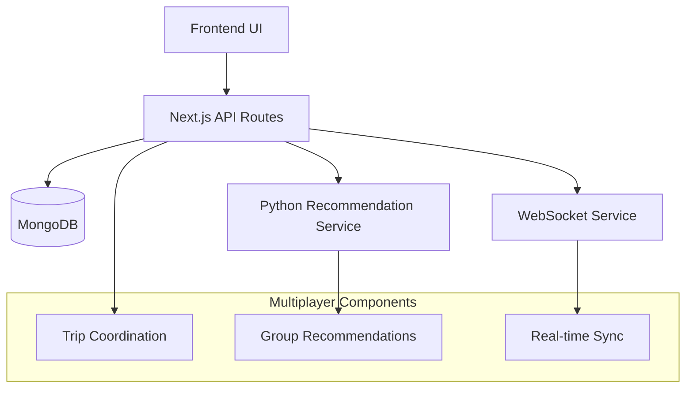
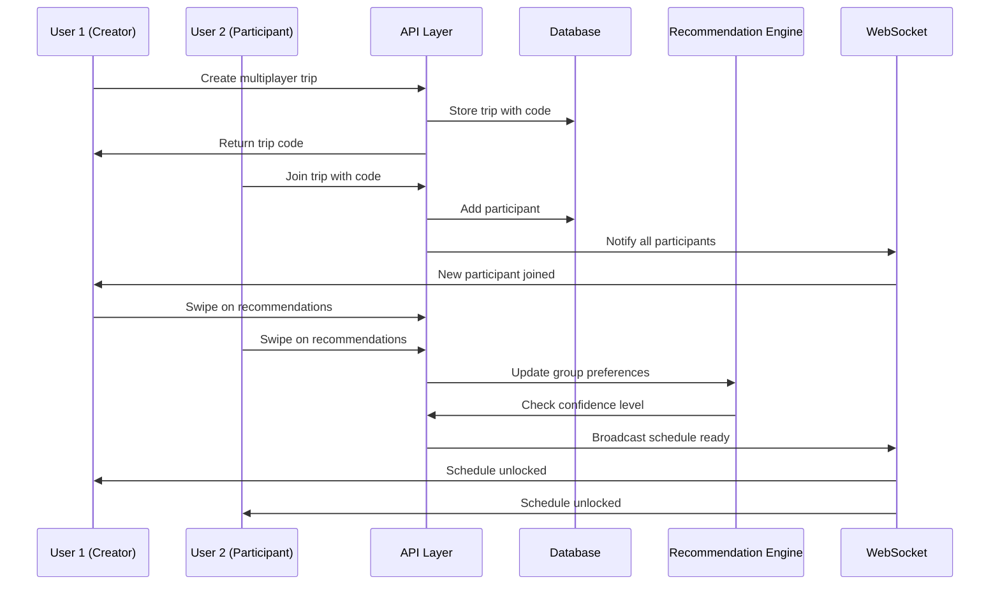

# Multiplayer Trips Design Document

## Overview

The multiplayer trips feature extends the existing single-user trip planning system to support collaborative planning between multiple users. The system maintains individual user preferences while generating group-optimized recommendations and provides a shared scheduling interface once sufficient confidence is achieved.

The design leverages the existing recommendation engine, user preference system, and scheduling components while adding multiplayer coordination, real-time synchronization, and group-based recommendation algorithms.

## Architecture

### High-Level Architecture



### Component Interaction Flow



## Components and Interfaces

### 1. Database Schema Extensions

#### Enhanced Trip Model
```typescript
interface IMultiplayerTrip extends ITrip {
  isMultiplayer: boolean;
  tripCode: string;
  participants: Array<{
    userId: string;
    joinedAt: Date;
    role: 'creator' | 'participant';
    hasCompletedPreferences: boolean;
  }>;
  groupPreferences: {
    combinedLikes: string[];
    combinedDislikes: string[];
    confidenceLevel: number;
    lastUpdated: Date;
  };
  scheduleUnlocked: boolean;
  scheduleUnlockedAt?: Date;
}
```

#### Trip Code Management
```typescript
interface ITripCode {
  code: string;
  tripId: string;
  createdAt: Date;
  expiresAt: Date;
  isActive: boolean;
}
```

### 2. API Endpoints

#### Trip Management
- `POST /api/trips/multiplayer` - Create multiplayer trip
- `POST /api/trips/join` - Join trip with code
- `GET /api/trips/[id]/participants` - Get trip participants
- `DELETE /api/trips/[id]/participants/[userId]` - Leave trip

#### Group Recommendations
- `POST /api/recommendations/group` - Get group-based recommendations
- `POST /api/swipe/group` - Record group member swipe
- `GET /api/trips/[id]/confidence` - Check group confidence level

#### Real-time Coordination
- `WebSocket /ws/trips/[id]` - Real-time trip updates
- `POST /api/trips/[id]/schedule/sync` - Sync schedule changes

### 3. Frontend Components

#### Multiplayer Trip Creation
```typescript
interface MultiplayerTripCreationProps {
  onTripCreated: (trip: IMultiplayerTrip) => void;
}
```

#### Trip Join Interface
```typescript
interface TripJoinProps {
  onTripJoined: (trip: IMultiplayerTrip) => void;
}
```

#### Group Swipe Interface
```typescript
interface GroupSwipeProps {
  tripId: string;
  participants: TripParticipant[];
  onSwipe: (itemId: string, action: 'like' | 'dislike') => void;
}
```

#### Collaborative Schedule Editor
```typescript
interface CollaborativeScheduleProps {
  tripId: string;
  schedule: ScheduleItem[];
  participants: TripParticipant[];
  onScheduleUpdate: (schedule: ScheduleItem[]) => void;
}
```

## Data Models

### Trip Code Generation
- 6-character alphanumeric codes (excluding ambiguous characters: 0, O, I, 1)
- Case-insensitive for user input
- 24-hour expiration for unused codes
- Collision detection and regeneration

### Group Preference Aggregation
```typescript
interface GroupPreferences {
  weightedLikes: Map<string, number>; // itemId -> weight based on participant count
  weightedDislikes: Map<string, number>;
  consensusItems: string[]; // Items liked by majority
  conflictItems: string[]; // Items with mixed reactions
}
```

### Confidence Calculation
```typescript
interface ConfidenceMetrics {
  totalSwipes: number;
  participantProgress: Map<string, number>; // userId -> swipe count
  groupConsensus: number; // 0-1 score based on agreement
  recommendationConfidence: number; // ML model confidence
  overallConfidence: number; // Combined score
}
```

## Correctness Properties

*A property is a characteristic or behavior that should hold true across all valid executions of a system-essentially, a formal statement about what the system should do. Properties serve as the bridge between human-readable specifications and machine-verifiable correctness guarantees.*

### Property Reflection

After reviewing all properties identified in the prework, several redundancies were found:
- Properties 1.1 and 1.5 both test trip code uniqueness - can be combined
- Properties 3.3 and 4.1 both test that all participants' preferences are considered - can be combined  
- Properties 5.4 and 6.1 both test real-time schedule synchronization - can be combined
- Properties 1.4, 7.1, and 7.3 all test participant display functionality - can be combined
- Properties 2.4 and 7.3 both test notification of new participants - can be combined

The consolidated properties eliminate redundancy while maintaining comprehensive coverage.

Property 1: Trip code uniqueness
*For any* set of multiplayer trips created by the system, all generated trip codes should be unique across all active trips
**Validates: Requirements 1.1, 1.5**

Property 2: Multiplayer trip persistence
*For any* trip created in multiplayer mode, the stored trip should have multiplayer status enabled and contain the generated trip code
**Validates: Requirements 1.3**

Property 3: Valid trip code joining
*For any* valid trip code and eligible user, entering the code should successfully add the user as a trip participant
**Validates: Requirements 2.1**

Property 4: Invalid trip code rejection
*For any* invalid trip code, the system should reject the join attempt and display an error message
**Validates: Requirements 2.2**

Property 5: Duplicate join prevention
*For any* user and trip, attempting to join the same trip multiple times should be prevented after the first successful join
**Validates: Requirements 2.5**

Property 6: Participant notification
*For any* trip with existing participants, when a new participant joins, all existing participants should receive notification of the new member
**Validates: Requirements 2.4, 7.3**

Property 7: Individual preference isolation
*For any* trip participant's swipe actions, their preferences should be recorded separately without affecting other participants' stored preferences
**Validates: Requirements 3.2**

Property 8: Group preference consideration
*For any* recommendation generation for a multiplayer trip, all participants' preferences should be weighted equally in the algorithm
**Validates: Requirements 3.3, 4.1**

Property 9: Interface independence
*For any* participant's swipe actions, other participants' recommendation interfaces should remain unchanged
**Validates: Requirements 3.5**

Property 10: Group-optimized recommendations
*For any* multiplayer trip recommendations, the suggested activities should align with the combined preferences of all participants
**Validates: Requirements 4.2**

Property 11: Preference conflict resolution
*For any* trip with conflicting participant preferences, the system should generate compromise activities that partially satisfy multiple preferences
**Validates: Requirements 4.3**

Property 12: Dynamic recommendation recalculation
*For any* trip when a new participant joins, the recommendation set should be recalculated to include their preferences
**Validates: Requirements 4.4**

Property 13: Confidence threshold unlocking
*For any* multiplayer trip, the shared schedule should only be unlocked when the system reaches exactly 95% confidence
**Validates: Requirements 5.1, 5.5**

Property 14: Schedule unlock notification
*For any* trip when the shared schedule is unlocked, all participants should receive notification of the unlock
**Validates: Requirements 5.2**

Property 15: Schedule consistency
*For any* shared schedule access by multiple participants, all participants should see identical itinerary data
**Validates: Requirements 5.3**

Property 16: Real-time schedule synchronization
*For any* participant's edits to the shared schedule, the changes should immediately appear for all other participants
**Validates: Requirements 5.4, 6.1**

Property 17: Concurrent editing conflict resolution
*For any* simultaneous edits by multiple participants, the system should resolve conflicts without data loss
**Validates: Requirements 6.2**

Property 18: Schedule modification history
*For any* changes made to the shared schedule, the system should maintain a complete history of all modifications
**Validates: Requirements 6.3**

Property 19: Schedule change validation
*For any* participant's attempt to add or remove activities, the system should validate changes against trip constraints
**Validates: Requirements 6.4**

Property 20: Equal editing privileges
*For any* trip participants, all should have identical editing capabilities on the shared schedule
**Validates: Requirements 6.5**

Property 21: Participant display completeness
*For any* multiplayer trip view, the interface should display all current participants with their names and profile information
**Validates: Requirements 1.4, 7.1, 7.2**

Property 22: Participant removal
*For any* participant who leaves a trip, they should be immediately removed from the participant list for all remaining members
**Validates: Requirements 7.4**

Property 23: Role distinction
*For any* multiplayer trip interface, the system should visually distinguish between trip creators and other participants
**Validates: Requirements 7.5**

## Error Handling

### Trip Code Management
- **Invalid Code Format**: Reject codes that don't match the 6-character alphanumeric pattern
- **Expired Codes**: Automatically deactivate codes after 24 hours and reject join attempts
- **Code Collision**: Regenerate codes when duplicates are detected during creation
- **Non-existent Codes**: Return appropriate error messages for codes that don't exist

### Participant Management
- **Duplicate Joins**: Prevent users from joining trips they're already part of
- **Maximum Participants**: Enforce reasonable limits on trip size (suggested: 10 participants)
- **Permission Errors**: Handle cases where users lack permission to join private trips
- **User Not Found**: Handle cases where participant user accounts are deleted

### Recommendation Engine
- **Insufficient Data**: Handle cases where participants haven't provided enough preference data
- **Service Unavailability**: Gracefully degrade when the Python recommendation service is unavailable
- **Conflicting Preferences**: Provide fallback recommendations when group preferences are irreconcilable
- **Confidence Calculation**: Handle edge cases in confidence scoring algorithms

### Real-time Synchronization
- **Connection Failures**: Implement reconnection logic for WebSocket disconnections
- **Message Ordering**: Ensure schedule updates are applied in the correct order
- **Concurrent Modifications**: Implement operational transformation for conflict resolution
- **State Synchronization**: Recover from desynchronized states between clients

### Schedule Management
- **Validation Failures**: Reject schedule changes that violate trip constraints
- **Capacity Conflicts**: Handle overlapping activities or venue capacity issues
- **Time Conflicts**: Prevent scheduling conflicts within the same time slots
- **Data Corruption**: Implement rollback mechanisms for failed schedule updates

## Testing Strategy

### Unit Testing Approach
The system will use Jest for unit testing with the following focus areas:
- Trip code generation and validation logic
- Group preference aggregation algorithms
- Confidence calculation functions
- Schedule conflict detection
- Real-time message handling

### Property-Based Testing Approach
The system will use fast-check for property-based testing to verify universal properties:
- **Library**: fast-check (JavaScript/TypeScript property-based testing library)
- **Test Configuration**: Minimum 100 iterations per property test
- **Property Test Tagging**: Each property-based test must include a comment with the format: `**Feature: multiplayer-trips, Property {number}: {property_text}**`
- **Coverage**: Each correctness property must be implemented by exactly one property-based test
- **Integration**: Property tests will be integrated into the existing Jest test suite

### Dual Testing Benefits
- **Unit tests** verify specific examples, edge cases, and integration points
- **Property tests** verify universal behaviors across all possible inputs
- **Combined coverage** ensures both concrete functionality and general correctness

### Test Data Generation
Property-based tests will use intelligent generators:
- **Trip Code Generator**: Produces valid and invalid code formats
- **User Preference Generator**: Creates realistic preference combinations
- **Schedule Generator**: Generates valid and conflicting schedule configurations
- **Participant Generator**: Creates various participant group compositions

### Real-time Testing
- **WebSocket Testing**: Mock WebSocket connections for real-time synchronization tests
- **Concurrency Testing**: Simulate simultaneous user actions to test conflict resolution
- **Network Failure Testing**: Test system behavior under various network conditions
- **State Recovery Testing**: Verify system recovery from disconnected states